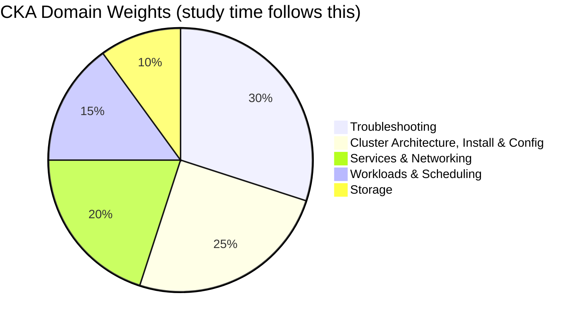
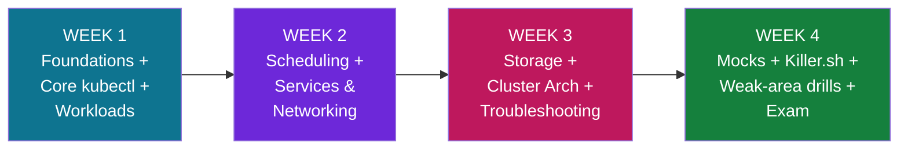
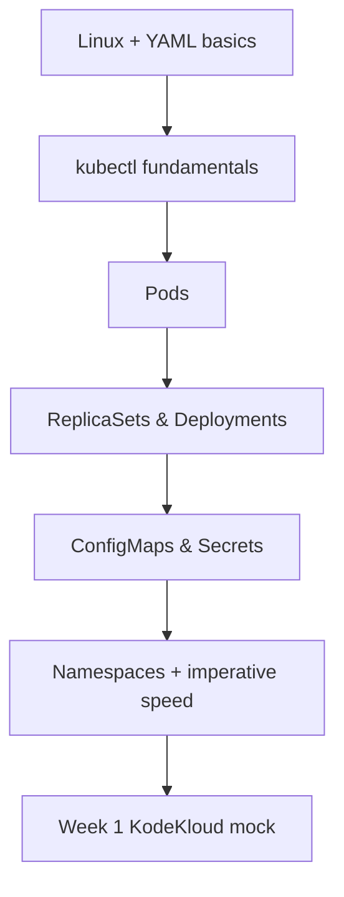
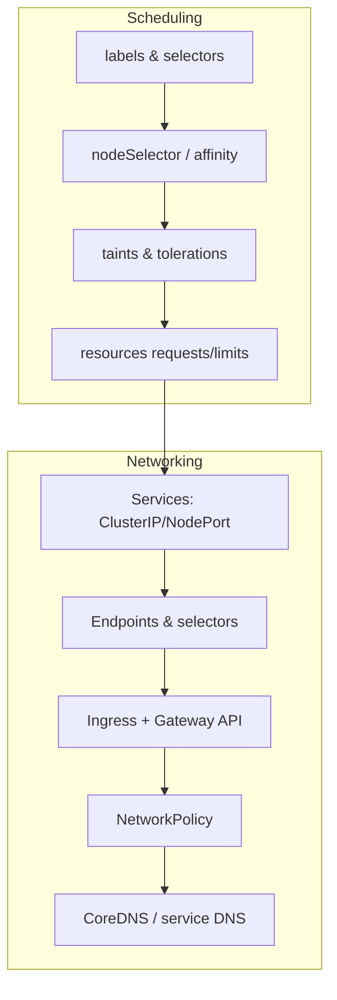
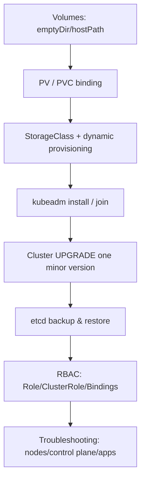
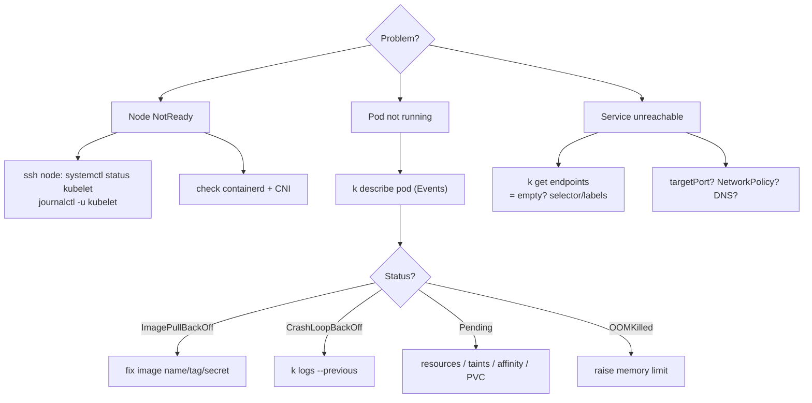
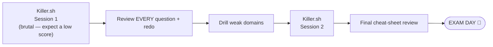
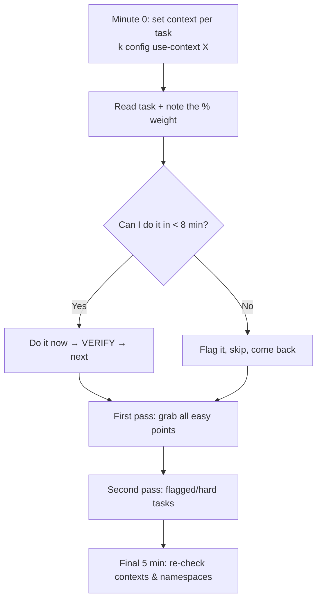

# 🚀 CKA in 4 Weeks — Beginner's Efficient Study Roadmap

> **Goal:** Pass the **Certified Kubernetes Administrator (CKA v1.36)** exam in **4 weeks / 128 hours** as a beginner.
> **Your stack:** KodeKloud CKA course + labs · KodeKloud mock exams · **Killer.sh** exam simulator (free with your exam registration).
> **Reality check:** This is an aggressive but achievable plan. The exam is **100% hands-on**. Reading is not studying — *typing* is studying. Spend **70% of every hour in a live terminal.**

---

## 📌 Exam Facts (know these cold)

| Item | Detail |
|---|---|
| **Format** | Performance-based, live clusters, ~15–20 tasks |
| **Duration** | 2 hours |
| **Pass mark** | 66% |
| **Version** | Kubernetes v1.36 |
| **Allowed docs** | `kubernetes.io/docs`, `/blog`, `kubernetes.io` GitHub, `helm.sh/docs` (one extra tab) |
| **Attempts** | 2 (one free retake) |
| **Free simulator** | 2 × Killer.sh sessions (each active 36h) |

### Domain weights — where your 128 hours should go



> **Strategy insight:** Troubleshooting (30%) + Cluster Architecture (25%) = **55% of the exam**. These get the most lab time. Storage is only 10% — learn it well but don't over-invest.

---

## 🗺️ The 4-Week Map at a Glance



### Time budget (128 h)

| Week | Focus | Hours | KodeKloud | Labs/Practice | Mock/Killer.sh |
|---|---|---|---|---|---|
| 1 | Foundations, Pods, Deployments, Config | 32 | 14 | 16 | 2 |
| 2 | Scheduling, Services, Networking | 32 | 13 | 16 | 3 |
| 3 | Storage, Cluster Arch, Troubleshooting | 32 | 12 | 16 | 4 |
| 4 | Full mocks + Killer.sh + revision | 32 | 2 | 12 | 18 |
| **Total** | | **128** | **41** | **60** | **27** |

> **~47% of all time is raw hands-on practice + simulators.** That ratio is what passes the exam.

---

## ⚙️ One-Time Setup (do this Day 1, ~1 hour)

You need a place to practice. Pick **one**:

| Option | Best for | Setup |
|---|---|---|
| **KodeKloud labs** | Guided practice (no setup) | Included in course ✅ |
| **killercoda.com** | Free browser scenarios | Zero setup, free ✅ |
| **kind** (local) | Fast throwaway multi-node clusters | `kind create cluster` |
| **kubeadm on 2 VMs** | Practicing install/upgrade (Domain 1!) | Multipass / VirtualBox |

> ⚠️ You **must** build at least one cluster with `kubeadm` by hand (Week 3). KodeKloud + Killercoda cover most topics, but the kubeadm install/upgrade tasks are best felt on your own VMs.

### The single most important productivity setup — your `~/.bashrc`

```bash
alias k=kubectl                       # type 'k' instead of 'kubectl' all day
export do="--dry-run=client -o yaml"  # generate YAML fast: k run x --image=nginx $do
export now="--force --grace-period=0" # delete pods instantly
source <(kubectl completion bash)     # TAB autocompletion
complete -o default -F __start_kubectl k   # autocompletion for the 'k' alias
```

**Why each line matters:**
- `alias k=kubectl` — you will type `kubectl` ~300 times in the exam. Save thousands of keystrokes.
- `export do=...` — lets you scaffold any object as YAML, then edit only what you need. **The #1 exam speed trick.**
- `export now=...` — pods deleted normally wait 30s; `$now` is instant when you must recreate quickly.
- `source <(kubectl completion bash)` — TAB-complete resource names and flags so you stop mistyping.

> On the real exam these aliases are **already configured** in `.bashrc`, but practice with them so they're muscle memory.

---

## 📅 WEEK 1 — Foundations, Pods & Workloads (32 h)

**Outcome:** You can create, inspect, and edit any core object from the CLI without thinking.



| Day | Hours | Topic | Resource |
|---|---|---|---|
| 1 | 5 | Setup + Linux/YAML refresher + `kubectl` basics | KodeKloud + bashrc setup |
| 2 | 5 | Pods, multi-container, `kubectl run`/`describe`/`logs` | KodeKloud + labs |
| 3 | 5 | ReplicaSets, Deployments, rollouts, scaling | KodeKloud + labs |
| 4 | 5 | ConfigMaps, Secrets, env injection | KodeKloud + labs |
| 5 | 6 | Namespaces, imperative commands, **speed drills** | Labs (repeat until fast) |
| 6 | 4 | Review + **KodeKloud Mock Exam 1** | Mock |
| 7 | 2 | Light: redo every task you got wrong | Labs |

### Core commands — Week 1 (with explanations)

```bash
# Create a pod imperatively
k run nginx --image=nginx:1.27
#  run        -> create a single pod
#  nginx      -> the pod name
#  --image    -> container image to use

# Generate a Deployment YAML WITHOUT creating it, then edit & apply
k create deployment web --image=nginx:1.27 --replicas=3 $do > web.yaml
#  $do expands to --dry-run=client -o yaml
#  --dry-run=client -> build the object locally, do NOT send to the cluster
#  -o yaml          -> print it as YAML so you can save/edit it

# Inspect what's wrong with a pod (your most-used command all month)
k describe pod web
#  describe -> shows events, image, mounts, probe results, why it's failing

# Read a container's logs
k logs web -c nginx --previous
#  -c nginx    -> pick a container in a multi-container pod
#  --previous  -> logs from the LAST crashed instance (vital for CrashLoopBackOff)

# Edit a live object
k edit deployment web
#  opens the object in vi; save to apply. Note: some fields are immutable.

# Update an image (rolling update)
k set image deployment/web nginx=nginx:1.28
#  nginx=nginx:1.28 -> container 'nginx' gets the new image tag

# Roll back a bad rollout
k rollout undo deployment/web
k rollout status deployment/web   # watch it finish
```

> **Daily habit starting Day 1:** every time you learn an object, recreate it **three ways** — imperative (`k run`/`k create`), `--dry-run` YAML, and full handwritten YAML. By Week 4 you'll instinctively pick the fastest path per task.

---

## 📅 WEEK 2 — Scheduling, Services & Networking (32 h)

**Outcome:** You can place pods exactly where you want and wire up + debug cluster networking.



| Day | Hours | Topic | Resource |
|---|---|---|---|
| 1 | 5 | Labels, selectors, manual scheduling, nodeSelector | KodeKloud + labs |
| 2 | 5 | Node affinity, taints/tolerations, resource req/limits | KodeKloud + labs |
| 3 | 5 | Services: ClusterIP, NodePort, Endpoints, DNS | KodeKloud + labs |
| 4 | 5 | Ingress + **Gateway API** (new), TLS | KodeKloud + labs |
| 5 | 5 | NetworkPolicy (ingress/egress, default-deny) | KodeKloud + labs |
| 6 | 4 | CoreDNS, DNS troubleshooting + **KodeKloud Mock 2** | Mock |
| 7 | 3 | **Killercoda** networking scenarios (timed) | Killercoda |

### Networking model — the mental picture

```
        ┌──────────────────────── Cluster ────────────────────────┐
 client │   Ingress / Gateway  ──►  Service (ClusterIP)            │
 ──────►│        (L7 rules)         │ selector: app=web            │
        │                           ▼                              │
        │                       Endpoints  ──► Pod  Pod  Pod       │
        │                       (pod IPs)     app=web (must match!) │
        │   NetworkPolicy = firewall around pods (allow/deny)      │
        │   CoreDNS = web-svc.default.svc.cluster.local resolution │
        └──────────────────────────────────────────────────────────┘
```

### Core commands — Week 2

```bash
# Expose a deployment as a Service
k expose deployment web --name=web-svc --port=80 --target-port=8080
#  --port        -> the Service's own port (what clients call)
#  --target-port -> the container port traffic is forwarded to

# THE networking debug command — does the Service have backends?
k get endpoints web-svc
#  <none> here = selector/label mismatch or pods not Ready. Check this FIRST.

# Taint a node so only tolerating pods land there
k taint node node01 gpu=true:NoSchedule
#  key=value:effect ; NoSchedule blocks new pods that don't tolerate it
k taint node node01 gpu=true:NoSchedule-   # the trailing '-' REMOVES the taint

# Label a node for nodeSelector / affinity
k label node node01 disktype=ssd

# Test DNS from a throwaway pod (rm = self-destruct when done)
k run dns --image=busybox:1.36 --rm -it --restart=Never -- nslookup web-svc
#  --rm        -> delete the pod automatically after the command finishes
#  --restart=Never -> make it a bare Pod, not a Deployment
#  -it         -> interactive terminal

# Check if a subject is allowed to do something (also great for RBAC week)
k auth can-i create deployments --as=system:serviceaccount:dev:builder -n dev
```

> 🔎 **Networking troubleshooting order (memorize):** `endpoints` → pod labels vs Service `selector` → `targetPort` vs container port → `NetworkPolicy` → CoreDNS pods in `kube-system`.

---

## 📅 WEEK 3 — Storage, Cluster Architecture & Troubleshooting (32 h)

**Outcome:** You can build/upgrade a cluster, back up etcd, manage RBAC, and systematically fix broken clusters. **This is the highest-value week (55% of the exam).**



| Day | Hours | Topic | Resource |
|---|---|---|---|
| 1 | 5 | Volumes, PV, PVC, access modes, reclaim policy | KodeKloud + labs |
| 2 | 5 | StorageClass, dynamic provisioning, expansion | KodeKloud + labs |
| 3 | 6 | **kubeadm install + join + cluster upgrade** (own VMs!) | KodeKloud + VMs |
| 4 | 6 | **etcd backup/restore** + RBAC (SA, Role, Binding) | KodeKloud + VMs |
| 5 | 6 | **Troubleshooting**: NotReady nodes, control plane, kubelet | KodeKloud + labs |
| 6 | 4 | App + networking troubleshooting + **KodeKloud Mock 3** | Mock |
| 7 | — | (rolls into Killercoda troubleshooting drills) | Killercoda |

### Control plane — what to check when things break

```
        CONTROL PLANE NODE                         WORKER NODE
 ┌─────────────────────────────┐         ┌──────────────────────────┐
 │  kube-apiserver  ◄────────┐  │         │  kubelet  ──► heartbeat   │
 │  kube-scheduler           │  │  TLS    │  kube-proxy (Service nets)│
 │  kube-controller-manager  ├──┼────────►│  container runtime        │
 │  etcd  (the cluster DB)   │  │         │  CNI plugin (pod network) │
 └─────────────────────────────┘         └──────────────────────────┘
   Static pods live in: /etc/kubernetes/manifests/  (edit = auto-restart)
   When kubectl itself is dead → debug with:  crictl ps / crictl logs
```

### Troubleshooting decision flow (the 30% domain)



### Core commands — Week 3 (the money commands)

```bash
# ---- etcd BACKUP (almost guaranteed exam task) ----
ETCDCTL_API=3 etcdctl snapshot save /opt/snap.db \
  --endpoints=https://127.0.0.1:2379 \
  --cacert=/etc/kubernetes/pki/etcd/ca.crt \
  --cert=/etc/kubernetes/pki/etcd/server.crt \
  --key=/etc/kubernetes/pki/etcd/server.key
#  ETCDCTL_API=3 -> use the v3 API (where snapshot lives)
#  --endpoints   -> where etcd listens (from the apiserver manifest)
#  --cacert/--cert/--key -> etcd requires mutual TLS; all three are mandatory

# ---- etcd RESTORE into a NEW dir, then point etcd manifest at it ----
ETCDCTL_API=3 etcdctl snapshot restore /opt/snap.db --data-dir=/var/lib/etcd-new
#  then edit /etc/kubernetes/manifests/etcd.yaml: hostPath -> /var/lib/etcd-new

# ---- CLUSTER UPGRADE (control plane) ----
kubeadm upgrade plan                 # shows available target versions
kubeadm upgrade apply v1.36.0        # upgrades control-plane components
#  on workers instead:  kubeadm upgrade node
#  always: drain -> upgrade kubeadm -> apply/node -> upgrade kubelet -> uncordon

# ---- Node drain for maintenance / upgrade ----
k drain node01 --ignore-daemonsets --delete-emptydir-data
#  --ignore-daemonsets   -> DaemonSet pods can't be evicted; skip them
#  --delete-emptydir-data-> ack that emptyDir scratch data will be lost
k uncordon node01        # allow scheduling again afterwards

# ---- RBAC (fast, imperative) ----
k create role pod-reader --verb=get,list,watch --resource=pods -n dev
k create rolebinding read --role=pod-reader --serviceaccount=dev:myapp -n dev
k auth can-i list pods --as=system:serviceaccount:dev:myapp -n dev   # -> yes/no

# ---- PV/PVC binding check ----
k get pvc            # STATUS must be 'Bound'; 'Pending' = size/accessMode/SC mismatch
```

> ⚠️ **Exam-saver:** before editing any `/etc/kubernetes/manifests/*.yaml`, run
> `cp /etc/kubernetes/manifests/kube-apiserver.yaml /root/apiserver.bak`.
> A typo crashes the API server and your `kubectl` dies — restore the backup to recover.

---

## 📅 WEEK 4 — Mocks, Killer.sh & Exam (32 h)

**Outcome:** Exam-ready. You finish tasks fast, verify every answer, and your weak spots are gone.



| Day | Hours | Activity |
|---|---|---|
| 1 | 6 | **Killer.sh Session 1** — full 2h timed, then start reviewing answers |
| 2 | 6 | Finish reviewing Killer.sh #1; **redo every task** until effortless |
| 3 | 6 | Targeted drills on your 2–3 weakest areas (likely troubleshooting/etcd) |
| 4 | 6 | KodeKloud "Ultimate Mocks" / lightning rounds, timed |
| 5 | 5 | **Killer.sh Session 2** (you should score much higher now) |
| 6 | 3 | Light: cheat-sheet review, docs-navigation practice, bookmark pages |
| 7 | — | **EXAM** (rest well the night before — do not cram) |

> 💡 **Killer.sh mindset:** it is intentionally **harder than the real exam**. A first-session score of 40–60% is normal. The gold is in the **detailed answer explanations** — they're a mini-course. If you can complete Killer.sh comfortably, the real exam feels easy.

---

## 🧭 Exam-Day Strategy



**Rules that win points:**
1. **Switch context first, every single task:** `kubectl config use-context <given>`. Wrong context = 0 points even with a perfect answer.
2. **Read the namespace.** Add `-n <ns>` or set it: `k config set-context --current --namespace=<ns>`.
3. **Generate, don't handwrite.** `k create ... $do > x.yaml`, then edit. Faster and fewer typos.
4. **Verify everything.** `k get`, `k describe`, `k auth can-i`, `curl`. A task isn't done until you confirmed it.
5. **Use the docs tab.** Copy YAML from `kubernetes.io/docs` — that's allowed and expected.
6. **Partial credit is real.** Never leave a task blank; do the parts you can.
7. **Don't get stuck.** 8-minute rule: flag and move on.

### Fast docs navigation (practice this in Week 4)
Bookmark these in your one allowed tab:
- "kubectl Cheat Sheet"
- "Pod / Deployment / Service / Ingress" example YAML pages
- "Configure a Pod to Use a PersistentVolume"
- "Operating etcd clusters" (backup/restore snippet)
- "Network Policies" example

---

## 🧾 One-Page Command Cheat Sheet (print this)

```bash
# CONTEXT & NAMESPACE
k config get-contexts
k config use-context <ctx>
k config set-context --current --namespace=<ns>

# GENERATE FAST (do = --dry-run=client -o yaml)
k run pod --image=nginx $do > pod.yaml
k create deploy web --image=nginx --replicas=3 $do > web.yaml
k expose deploy web --port=80 --target-port=8080 $do > svc.yaml
k create cm app --from-literal=KEY=val $do > cm.yaml
k create secret generic s --from-literal=pass=x $do > secret.yaml

# INSPECT / DEBUG
k get pods -A -o wide
k describe pod <p>
k logs <p> --previous
k get events --sort-by=.lastTimestamp
k top pod -A --sort-by=cpu        # needs metrics-server
k debug <p> -it --image=busybox:1.36 --target=<c>   # distroless debug

# SCHEDULING
k taint node n1 k=v:NoSchedule        # add ;  add trailing '-' to remove
k label node n1 disktype=ssd
k cordon n1 / k drain n1 --ignore-daemonsets --delete-emptydir-data / k uncordon n1

# RBAC
k create role r --verb=get,list --resource=pods -n ns
k create rolebinding rb --role=r --serviceaccount=ns:sa -n ns
k auth can-i <verb> <res> --as=system:serviceaccount:ns:sa -n ns

# CLUSTER LIFECYCLE
kubeadm token create --print-join-command
kubeadm upgrade plan && kubeadm upgrade apply v1.36.0
kubeadm certs check-expiration

# ETCD (set the cert flags once)
export E="--endpoints=https://127.0.0.1:2379 \
  --cacert=/etc/kubernetes/pki/etcd/ca.crt \
  --cert=/etc/kubernetes/pki/etcd/server.crt \
  --key=/etc/kubernetes/pki/etcd/server.key"
ETCDCTL_API=3 etcdctl $E snapshot save /opt/snap.db
ETCDCTL_API=3 etcdctl $E snapshot status /opt/snap.db -w table
```

---

## ✅ Weekly Self-Check (don't advance until you can)

- [ ] **Week 1:** Create a Deployment, scale it, update image, roll back — in under 3 minutes, from memory.
- [ ] **Week 2:** Expose a Deployment, debug an empty-endpoints Service, write a default-deny + allow NetworkPolicy.
- [ ] **Week 3:** Back up *and* restore etcd; upgrade a node; fix a NotReady node and a crashed apiserver.
- [ ] **Week 4:** Score comfortably on Killer.sh Session 2; finish a full mock with time to spare.

---

## ⏱️ If You Fall Behind (triage plan)

Limited time means ruthless prioritization. If a week slips, protect these in order:
1. **Troubleshooting** (30%) — never skip.
2. **etcd backup/restore + kubeadm upgrade** (high-frequency, high-point tasks).
3. **RBAC + Services/endpoints debugging.**
4. **Imperative speed** (saves time on *every* task).
5. Storage edge cases and Gateway API can be lighter if truly out of time.

---

## 🎒 Mindset

- **Type, don't read.** Watching videos feels productive but doesn't build speed. Pause and do every demo yourself.
- **Repeat the failures.** The tasks you get wrong are your highest-value practice. Redo them next day.
- **Time pressure is the real test.** Always practice with a timer in Weeks 3–4.
- **You only need 66%.** Bank the easy points, verify them, and don't tunnel on one hard task.

> **You've got 128 hours. Spend ~90 of them with your fingers on the keyboard, and you will pass.** Good luck! 🍀

---
*Last reviewed: June 2026*
*Practice labs weekly.*
